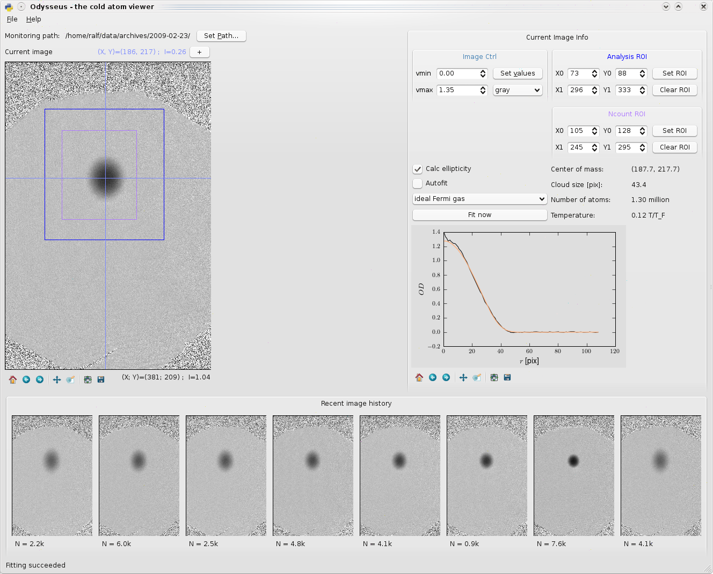
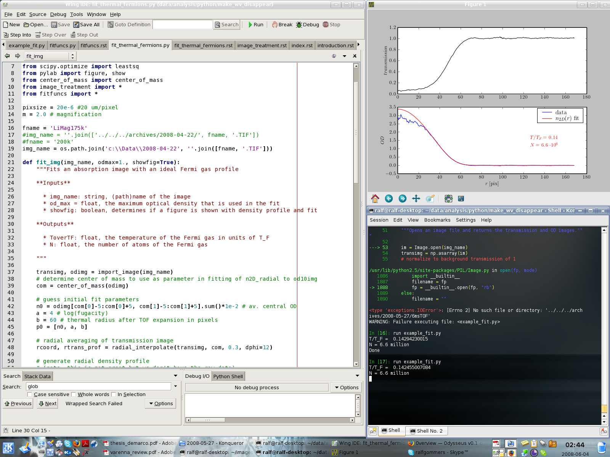
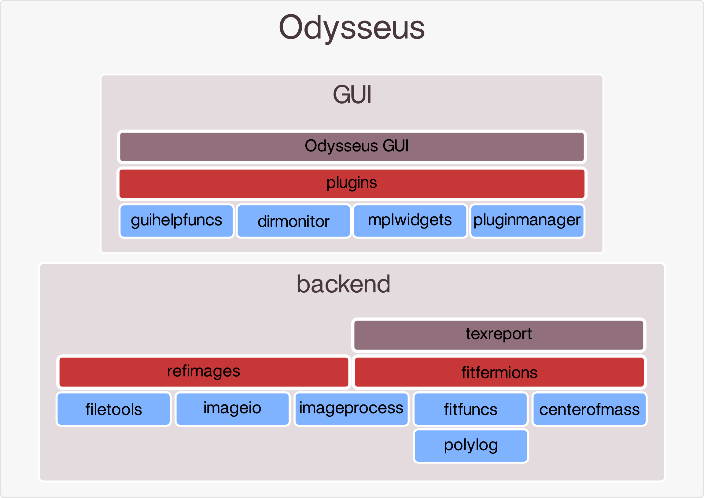

Introduction
============

Odysseus consists of a library of functions for analyzing data from cold-atom experiments and a graphical user interface (GUI) to these functions. In this section we will discuss what is needed to get Odysseus working, and the basics of using the GUI and library.

Prerequisites
-------------

Odysseus is written in `Python <http://python.org>`_ and requires a few Python libraries to run. The most important ones are `Numpy <http://scipy.org/NumPy>`_ (for fast numerics), `Scipy <http://scipy.org/>`_ (for fitting routines etc) and `Matplotlib <http://matplotlib.sourceforge.net/>`_ (for plotting). On Windows, a fully functional environment can be obtained simply by installing the `Enthought Python Distribution <http://enthought.com/products/epd.php>`_ and `PyQt4 <http://www.riverbankcomputing.co.uk/software/pyqt/download>`_. `Sage <http://www.sagemath.org/>`_ should work as well, but this has not yet been tested. On Linux, all libraries can be installed through the package manager on the most common distributions. This is all free software, so no license headaches. 

The GUI
-------

The GUI is straightforward to use, and allows new users to fit data with a number of functions without writing and scripts. It is also very useful to view images the moment they are acquired during an experimental run, and do some immediate analysis. The GUI is displayed below. For a detailed description of the functionality see the :ref:`section on the GUI <section-gui>`.

Writing analysis scripts
------------------------

The most efficient way of using Odysseus for analyzing a larger number of files is to write small scripts, that define the images you want to fit, and then to run these scripts from the command line. Standard Python works fine, but nicer is to use the `IPython <http://ipython.scipy.org/moin/>`_ interpreter. IPython and a nice editor of your choice can be used in the same way as you would use Matlab for interactive data analysis. A typical interactive session looks like this:

In order to be able to run data analysis scripts from any directory, it is essential that the Python interpreter knows where to find the Odysseus modules. This requires setting the environment variable PYTHONPATH to include the Odysseus directory. For Windows XP this can be done via *My Computer > Properties > Advanced (tab) > Environment Variables* and on Linux by defining PYTHONPATH in a shell startup rc file (.bashrc for example). To make sure this worked you can type ``echo $PYTHONPATH`` in a terminal.

Fitting an image
----------------

Once everything is set up we can test if it all works. To do this we need the example script below and an image. Both can be found in the Odysseus source directory.

.. code-block:: python
   :linenos:
   
   import os
   from odysseus.fitfermions import fit_img

   #dirname = '../../../archives/2008-05-27/'
   dirname = 'c:\\Data\\2008-05-27'

   ## this is how to fit a single image ##
   fname = '6msTOF.TIF'
   img_name = os.path.join(dirname, fname)
   fit_img(img_name, odmax=1.2, showfig=True)

Open a terminal, go to the Odysseus source directory and start ipython there (simply type "ipython -pylab" at the promt and press enter. Then run the script by typing "run example_fit.py".

The structure of Odysseus
-------------------------

Here is a visual representation of the structure of the code. Higher levels depend on lower levels but not the other way around, i.e. blue modules have no dependencies on other Odysseus code.

